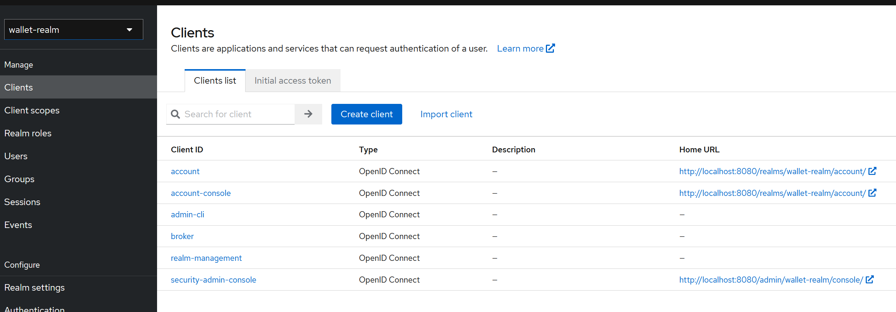

# securing_microservices_with_Keycloak

## What is `keycloak` ?
- Website : https://www.keycloak.org/

<cite>
Keycloak is an open-source Identity and Access Management (IAM) tool. Being an Identity and Access Management (IAM) tool, it streamlines the authentication process for applications and IT services. The purpose of an IAM tool is to ensure that the right people in a company have appropriate access to resources.

</cite>

<cite>
Keycloak is a separate server that you manage on your network. Applications are configured to point to and be secured by this server. Keycloak uses open protocol standards like OpenID Connect or SAML 2.0 to secure your applications.

</cite>


- The latest vesrion of is based on Quarkus instead of WildFly.
- Some info about Keycloak WildFly vs keycloak Quarkus : https://www.linuxfabrik.ch/en/blog/keycloak-17-quarkus-instead-of-wildfly/

- QUARKUS: https://quarkus.io/

<cite>
Traditional Java stacks were engineered for monolithic applications with long startup times and large memory requirements in a world where the cloud, containers, and Kubernetes did not exist. Java frameworks needed to evolve to meet the needs of this new world.

Quarkus was created to enable Java developers to create applications for a modern, cloud-native world. Quarkus is a Kubernetes-native Java framework tailored for GraalVM and HotSpot, crafted from best-of-breed Java libraries and standards. The goal is to make Java the leading platform in Kubernetes and serverless environments while offering developers a framework to address a wider range of distributed application architectures.
- from : https://quarkus.io/about/

</cite>


- More info : https://dzone.com/articles/what-is-keycloak-and-when-it-may-help-you 
- Keycloak documentaion : https://www.keycloak.org/documentation

## Installing and running `keycloak`.

- Link : https://www.keycloak.org/downloads

- We can install keycloak using multiple ways, but I am goin to use the [Docker image](https://quay.io/repository/keycloak/keycloak).

- Starting the container in dev mode :

```
$ docker run quay.io/keycloak/keycloak start-dev
```
- OR

```
$  docker run --name mykeycloak -p 8080:8080 -e KEYCLOAK_ADMIN=admin -e KEYCLOAK_ADMIN_PASSWORD=change_me quay.io/keycloak/keycloak:latest start-dev
```

- Running Keycloak in a container : https://www.keycloak.org/server/containers

- Invoking this command starts the Keycloak server in development mode.

- This mode should be strictly avoided in production environments because it has insecure defaults. 
- For more information about running Keycloak in production, take a look at the [Configuring Keycloak for production guide](https://www.keycloak.org/server/configuration-production).

- Visiting : `http://localhost:8080/`


- Login to administrator console : [username: admin, password: change_me]


- **Note**: we can also install it as application and run it.

```
$ cd keycloak-X
$ cd bin
$ kc.bat start-dev

```
- X in 'keycloak-X' is the version ...


- Keycloak uses JPA, so we can use it with any Database.
- It uses H2 by default (dev-mode), but we can run it with other DB.


- If we did not create a user already in running, we can create it after accessing keycloak.

## Using `keycloak`

### What is `Realm` ?

- A realm ( is a concept in Keycloak that refers to an object managing ) manages a set of users, credentials, roles, and groups. 
- A user in Keycloak belongs to only one realm and the user who logs in to Keycloak will log into that user’s realm.
- We can have multiple realms in a Keycloak server, these realms will be independent of each other and they only manage their users.
- Clients are entities that can request Keycloak to authenticate a user.
- When you start the Keycloak server, by default a master realm will be initialized:
- This realm is the realm with the highest power in the realm of the Keycloak server, the admin user in the master realm will have the right to view and manage the other realm.

- From : https://huongdanjava.com/overview-about-realm-in-keycloak.html

- Realm, c'est la zone à sécuriser, il concerne l'ensemble des applications à sécuriser (Youssfi).

- To create a Realm :


- Click Create > enter name (I named it 'wallet-realm') + enable > "create and access realm".

- No we can add our application to be secured : **`Clients`**

