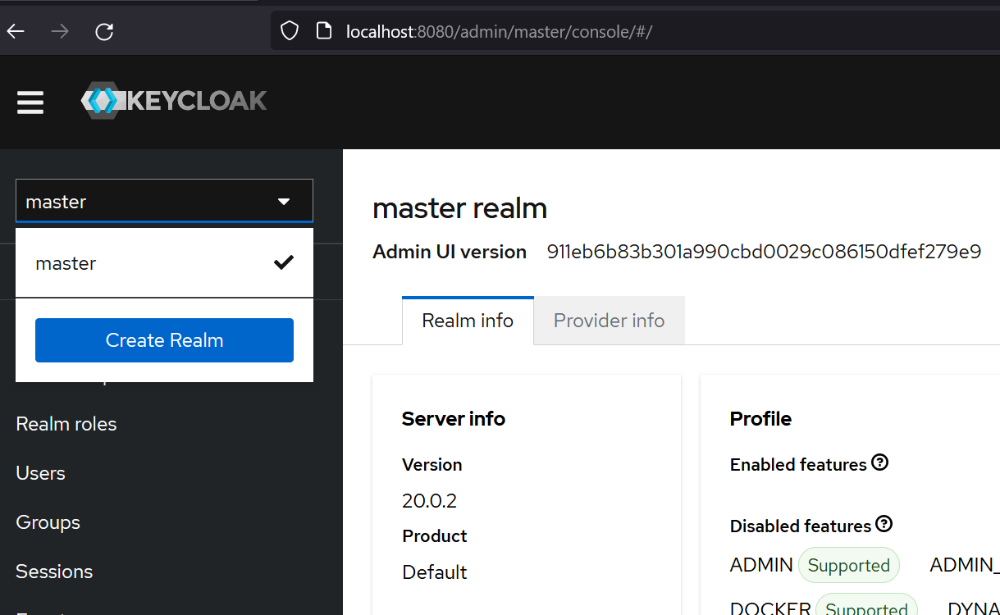
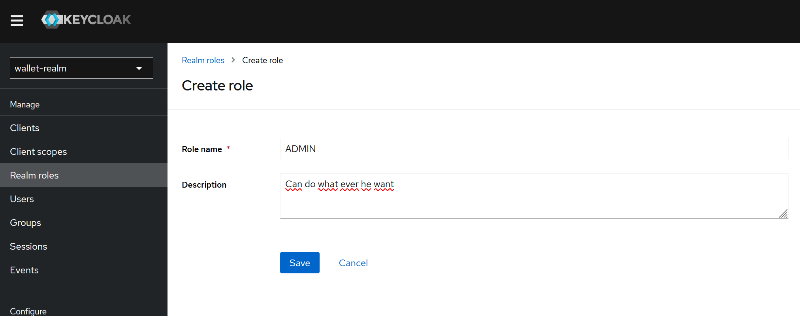
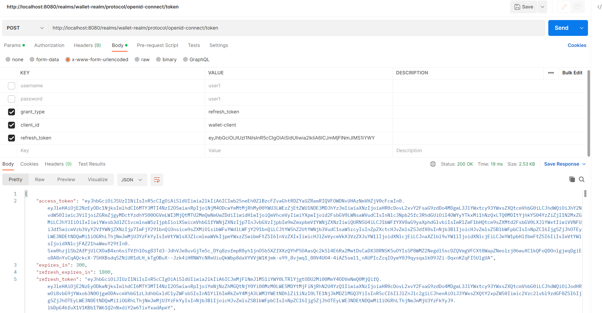

# securing_microservices_with_Keycloak

## What is `keycloak` ?
- Website : https://www.keycloak.org/

<cite>
Keycloak is an open-source Identity and Access Management (IAM) tool. Being an Identity and Access Management (IAM) tool, it streamlines the authentication process for applications and IT services. The purpose of an IAM tool is to ensure that the right people in a company have appropriate access to resources.

</cite>

<cite>
Keycloak is a separate server that you manage on your network. Applications are configured to point to and be secured by this server. Keycloak uses open protocol standards like OpenID Connect or SAML 2.0 to secure your applications.

</cite>


- The latest vesrion of is based on Quarkus instead of WildFly.
- Some info about Keycloak WildFly vs keycloak Quarkus : https://www.linuxfabrik.ch/en/blog/keycloak-17-quarkus-instead-of-wildfly/

- QUARKUS: https://quarkus.io/

<cite>
Traditional Java stacks were engineered for monolithic applications with long startup times and large memory requirements in a world where the cloud, containers, and Kubernetes did not exist. Java frameworks needed to evolve to meet the needs of this new world.

Quarkus was created to enable Java developers to create applications for a modern, cloud-native world. Quarkus is a Kubernetes-native Java framework tailored for GraalVM and HotSpot, crafted from best-of-breed Java libraries and standards. The goal is to make Java the leading platform in Kubernetes and serverless environments while offering developers a framework to address a wider range of distributed application architectures.
- from : https://quarkus.io/about/

</cite>


- More info : https://dzone.com/articles/what-is-keycloak-and-when-it-may-help-you 
- Keycloak documentaion : https://www.keycloak.org/documentation

## Installing and running `keycloak`.

- Link : https://www.keycloak.org/downloads

- We can install keycloak using multiple ways, but I am goin to use the [Docker image](https://quay.io/repository/keycloak/keycloak).

- Starting the container in dev mode :

```
$ docker run quay.io/keycloak/keycloak start-dev
```
- OR

```
$  docker run --name mykeycloak -p 8080:8080 -e KEYCLOAK_ADMIN=admin -e KEYCLOAK_ADMIN_PASSWORD=change_me quay.io/keycloak/keycloak:latest start-dev
```

- Running Keycloak in a container : https://www.keycloak.org/server/containers

- Invoking this command starts the Keycloak server in development mode.

- This mode should be strictly avoided in production environments because it has insecure defaults. 
- For more information about running Keycloak in production, take a look at the [Configuring Keycloak for production guide](https://www.keycloak.org/server/configuration-production).

- Visiting : `http://localhost:8080/`


- Login to administrator console : [username: admin, password: change_me]


- **Note**: we can also install it as application and run it.

```
$ cd keycloak-X
$ cd bin
$ kc.bat start-dev

```
- X in 'keycloak-X' is the version ...


- Keycloak uses JPA, so we can use it with any Database.
- It uses H2 by default (dev-mode), but we can run it with other DB.


- If we did not create a user already in running, we can create it after accessing keycloak.

## Using `keycloak`

### What is `Realm` ?

- A realm ( is a concept in Keycloak that refers to an object managing ) manages a set of users, credentials, roles, and groups. 
- A user in Keycloak belongs to only one realm and the user who logs in to Keycloak will log into that user’s realm.
- We can have multiple realms in a Keycloak server, these realms will be independent of each other and they only manage their users.
- Clients are entities that can request Keycloak to authenticate a user.
- When you start the Keycloak server, by default a master realm will be initialized:
- This realm is the realm with the highest power in the realm of the Keycloak server, the admin user in the master realm will have the right to view and manage the other realm.

- From : https://huongdanjava.com/overview-about-realm-in-keycloak.html

- Realm, c'est la zone à sécuriser, il concerne l'ensemble des applications à sécuriser (M.Youssfi).

- To create a Realm :



- Click Create > enter name (I named it 'wallet-realm') + enable > "create and access realm".

### What is a `Client` ?
- In Keycloak, applications or services you want to secure are named clients.

<pre>
Clients are entities that can request Keycloak to authenticate a user. Most often, clients are 
applications and services that want to use Keycloak to secure themselves and provide a single 
sign-on solution. Clients can also be entities that just want to request identity information or 
an access token so that they can securely invoke other services on the network that are secured by Keycloak.
</pre>

- No we can add our application to be secured : **`Clients`**


- Let's create "wallet-client" (client ID) client, I keep all that by default values except :
    - **Client ID** : 'wallet-client'
    - **Home URL** : Refers to the Home URL of my application [Ex: `http://localhost:4200` for my Angular App].
    - **Valid redirect URIs**: `http://localhost:4200/*`,
    - **Valid post logout redirect URIs** : `http://localhost:4200`
    - **Web origins**: `*` => Authorize any page from any URL to send requests to Keycloak .. That should be more specified to be more secure.
- Now have just created a 'Client' which is an application to be secured.


### Creating `Users` ?

- Create User


- Setup Password via Credentials


- **Temporary** in password creation means if the user is required to change the password after login or not.


### Creating Roles 
- Via `Realm roles` we can create roles.



- And affect the roles to users via `role mapping` in each user > `Assign role`.


- In this case our `User1` has [ADMIN, USER] and `User2` has [USER] roles.

## Testing with Postman 

- Here we will simulate the behavior that, we will consult keycloak from our application.
- We will use directly `Postman` as tool.
- In our `Realm Settings` we can  access the `OpenID Endpoints configuration`.
- There we can find the address to use : `token_endpoint : http://localhost:8080/realms/wallet-realm/protocol/openid-connect/token`.

- We will use this address in postman with :
    - Header
    ```json
    {"Content-Type" : "application/x-www-form-urlencoded"}
    ```
    - Body
    ```json
    {"username":"user1",
    "password" :"user1",
    "grant_type":"password",
    "client_id": "wallet-client"}
    ```

- By the `grant_type` we specify the type of credentials we use.
- `client_id` is the id of the Keycloak Client we want to access.


- We can see our Token info (Pyload Data) by encoding it (access_token) on the : https://jwt.io/

```json
{
  "exp": 1671286465,
  "iat": 1671286165,
  "jti": "253560a2-08ef-4a8e-9074-5dd5586ca7ec",
  "iss": "http://localhost:8080/realms/wallet-realm",
  "aud": "account",
  "sub": "ddff8207-c7aa-48ef-b724-1562d06e0d7b",
  "typ": "Bearer",
  "azp": "wallet-client",
  "session_state": "89f2a912-a741-4402-b8da-8c6bf257c1dc",
  "acr": "1",
  "allowed-origins": [
    "*"
  ],
  "realm_access": {
    "roles": [
      "offline_access",
      "ADMIN",
      "uma_authorization",
      "default-roles-wallet-realm",
      "USER"
    ]
  },
  "resource_access": {
    "account": {
      "roles": [
        "manage-account",
        "manage-account-links",
        "view-profile"
      ]
    }
  },
  "scope": "profile email",
  "sid": "89f2a912-a741-4402-b8da-8c6bf257c1dc",
  "email_verified": false,
  "name": "user1",
  "preferred_username": "user1",
  "given_name": "user1",
  "family_name": "",
  "email": "user1@gmail.com"
}
```

- We can see that our used has [ADMIN, USER] roles.
- We can configure the `keys` and `token` via `Realm Settings`.

- There is in the response `access_token` and `refresh_token`.
- **`refresh_token`**: is used to get the new `access_token` if the last one is expired.

<pre>
... for security purposes, access tokens may be valid for a short amount of time. Once they 
expire, client applications can use a refresh token to "refresh" the access token. That is, a 
refresh token is a credential artifact that lets a client application get new access tokens 
without having to ask the user to log in again.
</pre>
- https://auth0.com/blog/refresh-tokens-what-are-they-and-when-to-use-them/


- In the diagram above, SPA = Single-Page Application; AS = Authorization Server; RS = Resource Server; AT = Access Token; RT = Refresh Token.

- We can use `refresh_token` as `grant_type` now, so no need to the `username` and `password`, but we should provide the `refresh_token` instead.




